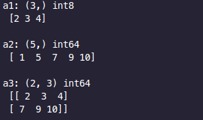
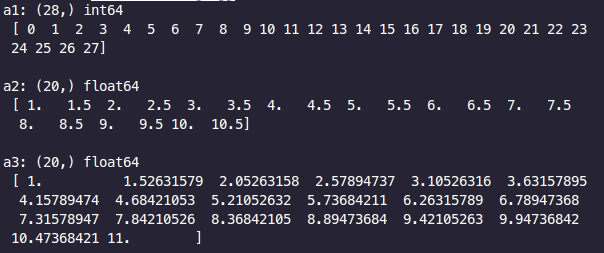
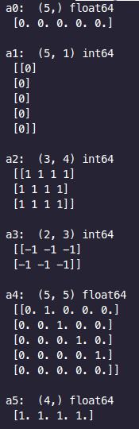
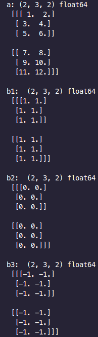

[상위 문서로 이동](../README.md)

# 배열 생성

## 파이썬 객체 (List, Tuple)

- 2차원 이상은 반드시 열의 개수가 일치해야 함
- 요소 중 실수가 하나라도 포함되면 실수 타입
- 정수 요소의 디폴트 타입은 `int64`이고, 실수 요소의 디폴트 타입은 `float64`

```python
import numpy as np

show = lambda m, o : print(m, o.shape, o.dtype, '\n', o, "\n")     # 메크로 설정

a1 = np.array([2, 3, 4], dtype=np.int8)
a2 = np.array((1,5,7,9,10))
a3 = np.array([[2,3,4], [7,9,10]])

show("a1:", a1)
show("a2:", a2)
show("a3:", a3)
```



## 범위 기반

- `arange()`는 `range()`처럼 주어진 [start, stop]에서 균일한 정수, 실수 배열 반환
  - `numpy.arange([start]stop, [step], dtype=None)`
- `linspace()`는 `arange()`와 유사하나 `step`이 실수(*float*)이면 오차가 발생할 수 있으므로 개수 사용
  - `numpy.linspace(start, stop, num=50, endpoint=True, retstep=False, dtype=None, axis=0)`

++ 자세한 차이

`arange()`의 step은 start, stop인 최소값, 최대값 사이 중 최소값부터 시작해 해당 step을 건너가며 수를 채우는 경우를 말한다. 파이썬 일반 함수 `range()`와 같은 역할을 맡고 있다. 다만 `linspace()`는 step이 배열의 개수이며, `start~stop 사이의 정수 개수` / `step` 의 값을 간격으로 두고 배열을 채운다. 이런 차이점을 두어 두 함수의 기능을 확연하게 구분시킨다.

```python
import numpy as np

show = lambda m, o: print(m, o.shape, o.dtype, '\n', o, '\n')

a1 = np.arange(27+1)
a2 = np.arange(1, 10+1, 0.5)
a3 = np.linspace(1, 10+1, 20)

show("a1:", a1)
show("a2:", a2)
show("a3:", a3)
```



## 특정 값으로 초기화

- `numpy.zeros(shape, dtype=float)` : 배열 전체를 0으로 초기화
- `numpy.ones(shape, dtype=None)`   : 배열 전체를 1로 초기화, 기본 타입은 float
- `numpy.full(shape, fill_value, dtype=None)` : 배열 전체를 전달한 값으로 초기화
- `numpy.eye(N, M=None, k=0, dtype=float)` : N x M 배열에 대해 대각선이 1이고, 나머지는 0으로 초기화
  - M을 생략하면 M=N (항등 또는 단위 행렬(*identity matrix*)), k는 대각선 인덱스로 0은 기준 대각, 양수는 기준 대각 위쪽, 음수는 아래쪽
- `numpy.diag(a, k=0)` : 단위 행렬의 대각선 값들을 하나의 배열로 반환

```python
import numpy as np

show = lambda m, o : print(m, o.shape, o.dtype, '\n', o, '\n')

a0 = np.zeros(5)
a1 = np.zeros((5,1), dtype=int)
a2 = np.ones((3,4), dtype=int)
a3 = np.full((2,3), -1)
a4 = np.eye(5, k=1)
a5 = np.diag(a4, k=1)

show("a0: ", a0); show("a1: ", a1); show("a2: ", a2);
show("a3: ", a3); show("a4: ", a4); show("a5: ", a5);
```



## 기존 배열 복사

- `numpy.ones_like(a, dtype=None)` : 1로 채워진 배열
- `numpy.zeros_like(a, dtype=None)` : 0으로 채워진 배열
- `numpy.full_like(a, fill_value, dtype=None)` : 전달한 값으로 채워진 배열

```python
import numpy as np

show = lambda m, o : print(m, o.shape, o.dtype, '\n', o, '\n')

a = np.linspace(1, 12, 12).reshape((2, 3, 2))

b1 = np.ones_like(a)
b2 = np.zeros_like(a)
b3 = np.full_like(a, -1)

show("a:", a)
show("b1: ", b1)
show("b2: ", b2)
show("b3: ", b3)
```

