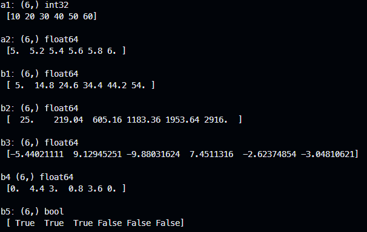
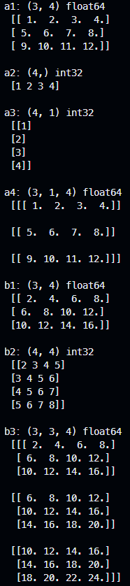

[상위 문서로 이동](../README.md)

# 기본 연산

## 산술 연산과 관계 연산

산술 연산과 관계 연산은 **행렬 요소 사이 1:1로 적용**되며 관계 연산은 불결

- 피연산자는 배열 또는 스칼라 값으로 둘 다 배열일 때는 `shape`와 `size`가 같아야 함.
  - 스칼라 값은 같은 크기 및 모양의 배열로 브로드캐스팅(*broadcasting*)한 후 수행
- 산술 연산은 연산자 (+, -, *, /, %, **)와 함수(numpy 모듈의 `add`, `subtract`, `multiply`, `divide`, `mod`, `power`) 모두 지원.  __*는 일반적인 행렬 곱셈 아님!__
- 관계 연산의 결과는 불 배열

```python
import numpy as np

show = lambda m, o : print(m, o.shape, o.dtype, '\n', o, '\n')

a1 = np.array([10, 20, 30, 40, 50, 60])
a2 = np.linspace(5, 6, a1.size)

b1 = a1 - a2
b2 = np.power(b1, 2)    # b1 ** [2, 2, 2, 2, 2, 2]
b3 = np.sin(a1) * 10    # np.sin(a1) * [10, 10, 10, 10, 10, 10]
b4 = a1 % a2
b5 = b1 <25             # b1 < [25, 25, 25, 25, 25, 25]

show("a1:", a1); show("a2:", a2)
show("b1:", b1); show("b2:", b2); show("b3:", b3); show("b4", b4); show("b5:", b5)
```



## 브로드캐스팅

스칼라 값이나 벡터를 배열과 연산할 때 이를 배열의 `share`와 같도록 확장한 후 기존 데이터 복사

- 배열과 스칼라 값 사이 연산 : 스칼라를 배열의 `share`로 확장한 후 스칼라 값 복사
- 벡터와 벡터 사이 연산 : 벡터 N, M에 대해 양쪽 다 배열의 N x M shape로 확장한 후, 행 또는 열 단위 요소 복사
- 배열과 벡터 사이 연산 : **배열의 마지막 축 크기와 벡터의 크기가 같을 때**, 벡터를 배열의 `shape`로 확장한 후 벡터 요소 복사
- 크기가 다른 배열과 배열 사이 연산 : 두 배열의 마지막 축부터 차례로 비교해 **축의 크기가 같거나 1일 때**, 양쪽 배열을 큰 축 기준으로 확장한 후 배열 요소 복사

```python
import numpy as np

show = lambda m, o : print(m, o.shape, o.dtype, '\n', o, '\n')

a1 = np.linspace(1, 12, 12).reshape((3,4))
a2 = np.arange(1,5)
a3 = a2.reshape((4, 1))
a4 = a1.reshape((3, 1, 4))

b1 = a1 + a2
b2 = a2 + a3
b3 = a1 + a4

show("a1:", a1); show("a2:", a2); show("a3:", a3) show("a4:", a4)
show("b1:", b1); show("b2:", b2); show("b3:", b3)
```

