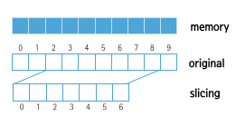
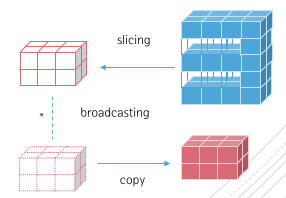

[상위 문서로 이동](../README.md)

# 인덱싱과 슬라이싱

리스트처럼 NumPy 배열도 *인덱스* 로 요소에 접근하고 원하는 부분만 잘라내는 *슬라이싱* 이 가능하다. 

단, 리스트와 다른 점은 **슬라이싱은 원본 배열의 참조**하는 새로운 배열이므로 **슬라이싱된 배열을 수정하면 원본 배열도 함께 수정** 된다.

## 1차원 배열 

`[[start]:[end]:[step]]`

- 인덱스 i가 `start`일 때 `i<end` 동안 `i+=step` 단위로 이동하여 요소 접근. `i`가 음수면 마지막 요소부터 역순으로 접근.
- `start`를 생략하면 *0* , `end`를 생략하면 *-1(마지막 요소)* , `step`을 생략하면 *1*

```py
import numpy as np

show = lambda m, o: print(m, o.shape, o.dtype, '\n', o, '\n')

a1 = np.arange(1, 10+1) ** 2
a2 = a1[2:9]                  # 슬라이싱 저장

show("a1", a1) ; show("a2", a2)

a1[3] = a1[1] + a1[2]
a2[:5:2] = 10_1000            # [0:5:2] : 0~5까지, 2만큼 건너뛰어 10_1000변환 -> 이때 a1도 같이 변함!!!!

for i in range(len(a1)):
      print(a1[(i+1)*-1], end=',')        # 역순 출력
print()
```



## 다차원 배열

다차원 배열은 축당 하나의 인덱스를 가질 수 있으며 인덱스는 쉼표로 구분 -> `[x, y]`

- 축 수보다 적은 인덱스를 제공하면 누락된 인덱스는 슬라이스로 간주
- `점(...)`은 완전한 인덱싱에 필요한 만큼의 콜론을 나타냄
  - ex) 5차원 배열 x에 대해
    - `x[1,2, ...] == x[1,2,:,:,:]`
    - `x[...,3] == x[:,:,:,:,3]`
    - `x[4,...,5,:] == x[4,:,:,5,:]`
- 다차원 배열에 대한 반복은 첫 번째 축에 대해 수행
  - 반복자인 **flat 속성** 을 이용하면 배열의 모든 요소에 접근할 수 있음!
  
슬라이싱할 때 *추가 연산* 을 통해 **브로드캐스팅이 발생하면 사본 복사!**

```py
import numpy as np

show = lambda m, o: print(m, o.shape, o.dtype, '\n', o, '\n')

a1 = np.fromfunction(lambda x,y,z : x+y+z, (2,5,4), dtype=int)
a2 = a1[:, 1::2, :3] * 10     # a2는 새로운 배열! : 크기가 다르기에 브로드캐스팅, 즉 사본 복사!

a2[1, ...] = -1

show("a1", a1)
show("a2", a2)
for array in a2:
      print("out:\n", array)

# for element in a2.flat
#     print(element, end=',')
```

