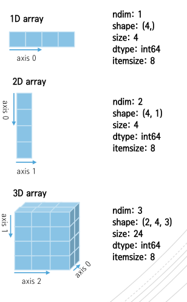

[상위 문서로 이동](../README.md)

# ndarray

Numpy의 다차열 배열 객체

## 주요 속성

- `ndarray.ndim` : 배열의 축(*axis*) (차원 (*dimensions*)) 수
- `ndarray.shape` : 배열의 차원으로, **각 차원 배열의 크기를 정수 튜플**로 나타냄.
  - $(4_{\,axis\,0}),\, (4_{\,axis\,0},\, 3_{\,axis\,1}),\,(2_{\,axis\,0},\, 4_{\,axis\,1}\, 3_{\,axis\,2})$
  - $4\approx(4,)\,\Rightarrow\,(1,\,4)$ : 1x4행 벡터
  - (4, 1) : 4x1 열 벡터

- `ndarray.size` : 배열의 총 요소수로, 각 차원 배열의 크기를 모두 곱한 값
- `ndarray.dtype` : 배열 요소 타입
  - 정수 : `numpy.int8`, `numpy.int16`, `numpy.int32`, `numpy.int64` (== int, 정수 기본 타입)
  - 실수 : `numpy.float16`, `numpy.float32`, `numpy.float64` (== float, 실수 기본 타입), `numpy.float128`
  - 기타 : `numpy.complex`, `numpy.bool`, `numpy.str`, `numpy.object`
- `ndarray.itemsize` : 바이트 단위 배열 요소의 크기 (요소 타입 크기)
- `ndarray.data`: 실제 배열 요소를 포함하는 버퍼로, 이미지나 오디오 같은 바이너리 데이터를 다룰 때 사용

