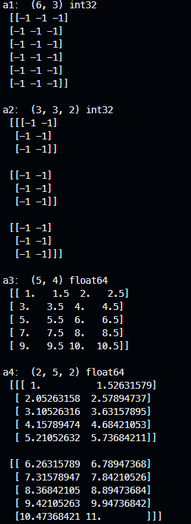

[상위 문서로 이동](../README.md)

# 모양 변경

배열은 각 축을 따라 요소의 수로 지정된 모양을 가진다.

- 배열 자체는 변하지 않고 새로운 차원으로 모양만 바꾸므로 size는 같아야 하는 `reshape()`
  - `numpy.reshape(a, new_shape)`
  - `ndarray.reshape(new_shape)`
- 모양에 맞춰 배열 크기도 함께 변경하므로 새 모양의 size가 더 클 시 나머지 요소는 0으로 채우는 `resize()`
  - `ndarray.resize(new_shape)` 

```python
import numpy as np

show = lambda m, o : print(m, o.shape, o.dtype, '\n', o, '\n')

a1 = np.full((6,3), -1)
a2 = np.reshape(a1, (3,3,2))
a3 = np.arange(1, 10 + 1, 0.5).reshape((5,4))
a4 = np.linspace(1, 10 + 1, 20).reshape((2,5,2))

show("a1: ",a1)
show("a2: ",a2)
show("a3: ",a3)
show("a4: ",a4)
```



