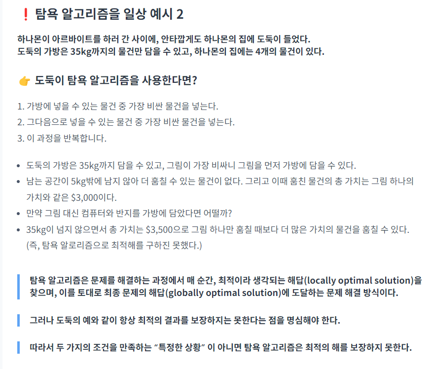

[상위 문서로 이동](../README.md)

# Greedy Algorithm

## 탐욕 알고리즘(Greedy Algorithm)이란?

**현재 상황에서 지금 당장 좋은 것만 고르는 방법**

- Greedy는 __탐욕스러운, 욕심 많은__ 이라는 뜻이다.
- 다른 말로 욕심쟁이기법이라고 한다.
- **매순간 최적이라고 생각하는 해를 선택**해 나가서 **최종적으로 최적의 해에 도달하는 알고리즘**이라고 할 수 있다.

그렇기 때문에 구한 해가 항상 최적임을 보장받지는 않아서 **근사값을 구하는 용도**로 사용되기도 한다.

탐욕 알고리즘을 적용할 수 있는 문제들은 지역적으로 최적이면서 전역적으로 최적인 문제들이다.

## 탐욕 알고리즘 문제를 해결하는 방법

1. 선택 절차(*Selection Procedure*): 현재 상태에서의 최적의 해답 선택
2. 적절성 검사(*Feasibility Check*): 선택된 해가 문제의 조건을 만족하는지 검사
3. 해답 검사(*Solution Check*): 원래의 문제가 해결되었는지 검사하고, 해결되지 않았다면 선택 절차로 돌아가 위 과정 반복

## 탐욕법이 충족되기 위한 조건

1. 탐욕적 선택 속성(*Greedy Choice Property*): 앞의 선택이 이후의 선택에 영향을 주지 않을 때
2. 최적 부분 구조(*Optimal Substructure*): 문제에 대한 최적의 해가 부분문제에 대해서도 역시 최적의 해 일때

이 조건들을 만족하지 못하면 최적의 해를 구하지 못하고 근사값만 구할 수 있다. 이 역시 어느 정도까지 최적해에 가까운 해를 구할 수 있는지를 보장하려면 엄밀한 증명이 필요하다.

탐욕 알고리즘을 적용하여 언제나 최적해를 구할 수 있는 문제인 **매트로이드**가 존재하는데, 이 문제는 그리디 알고리즘을 이용하여 빠른 계산 속도로 답을 구할 수 있다.

## 매트로이드가 아닐 경우

## 출처

https://hanamon.kr/%EC%95%8C%EA%B3%A0%EB%A6%AC%EC%A6%98-%ED%83%90%EC%9A%95%EC%95%8C%EA%B3%A0%EB%A6%AC%EC%A6%98-greedy-algorithm/