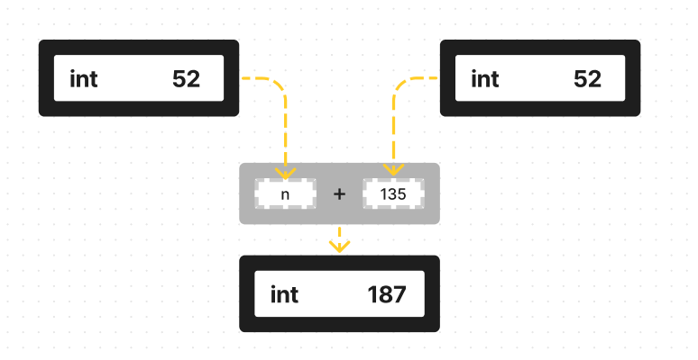
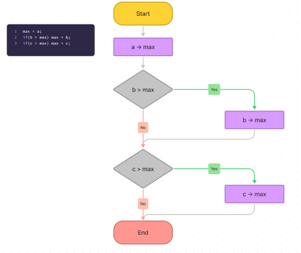

# 알고리즘이란?

## 최댓값 구하는 알고리즘
먼저 세 정수 값을 입력하고 최댓값을 구하는 프로그램입니다.

```C
#include <stdio.h>

int main(void) {
    int a, b, c;
    int max;

    printf("세 정수의 최댓값을 구합니다!.");
    printf("a의 값 : "); scanf("%d", &a);
    printf("b의 값 : "); scanf("%d", &b);
    printf("c의 값 : "); scanf("%d", &c);

    /*핵심 알고리즘*/
    max = a;
    if(b > max) max = b;
    if(c > max) max = c;
    /*------------------*/

    printf("최댓값은 %d입니다.\n", max);

    return 0;
}
```

변수 a,b,c의 최댓값을 max로 구하는 과정은 다음과 같은 **순서대로 동작합니다.**
1. max에 a 값을 넣는다
2. b 값이 max보다 크면 max에 b 값을 넣는다.
3. c 값이 max보다 크면 max에 c 값을 넣는다.

위 코드는 위와 같은 순서로 움직였으며, 2와 3번 과정은 if문이다. 이 2, 3번 문장은 ()안에 있는 식의 평가 결과에 따라 max에 b의 값이 대입되기도 하고 아니었기도 합니다. 이 개념들을 정리한 개념은 다음과 같습니다.

- __순차적(concatenation) 구조__: 여러 문장(프로세트)이 순차적으로 실행되는 구조
- __선택(Selection) 구조__: 프로그램의 실행 흐름을 변경하는 if문
   
### 연산자와 피연산자 / 식과 식의 평가

__연산자와 피연산자__

- __연산자(Operator)__: 프로그래밍 언어에서 +, > 등 연산을 수행하는 기호
  - 단항 연산자(Unary Operator): 피연산자가 1개(예: `a++`)입니다.
  - 2항 연산자(Binary Operator): 피연산자가 2개(예: `a < b`)
  - 3항 연산자(Ternary Operator): 피연산자가 3개(예: `a ? b : c`)
- __피연산자(Operand)__: 연산의 대상이 되는 식

예를 들어, b와 max 값의 대소 관계를 판정하는 식 `b > max`에서 연산자는 `>`이며, 피연산자는 `b`와 `max`이다.   
   
__식과 식의 평가__
프로그램을 실행할 때 식이 평가됩니다.

__식__: 다음과 같은 요소를 통틀어 말합니다.
- 변수
- 상수
- 변수나 상수를 연산자로 결합한 것

식 `x = n + 135`를 살펴 보겠습니다. 이때 변수 x와 n은 int형입니다. 알고리즘에선 이 식에서 x,n,135, n + 135, x = n + 135는 모두 식입니다. 또한 ○○연산자와 피연산자가 결합한 식을 ○○식이라고 합니다. 예컨대 대입 연산자에 의해 x와 n+135가 결합된 식 x = n + 135는 **대입식(Assignment Experssion)**입니다.

__식의 평가__
원칙적으로 모든 수식에는 값이 있습니다.(다만 C에서는 특별한 형태인 void형의 식만 값이 없습니다.) 그 값은 프로그램을 실행할 때 확인할 수 있으며 이를 **평가(evaluation)**(식의 값을 알아내는 것)이라고 합니다. 
   
변수 n의 값이 52이므로 n, 135, n + 135의 각 식을 계산한 값은 52, 135, 187입니다. 세 값의 형은 모두 int형이며, 아래에서 그림을 보면 왼쪽의 작은 글자가 '형'dlrh, 오른 쪽의 큰 글자가 '값'입니다.


### 순서도

세 값의 최댓값을 구하는 순서를 이해하기 쉽게 **순서도(flowchart)**를 사용해보겠습니다. 이 그림은 세 값의 최댓값을 구하는 순서도입니다.
   

   
회색 화살표 선을 따라 위에서 아래로 향하고, 그 과정에서 사각형 안에 작성한 처리 과정이 실행됩니다. 그리고 마름모를 지날 때는 그 안에 작성된 '조건'을 평가하여 Yes, No 중 하나를 따라갑니다. 자세한 내용은 뒤에 '순서도의 기호'에 나타나 있습니다.