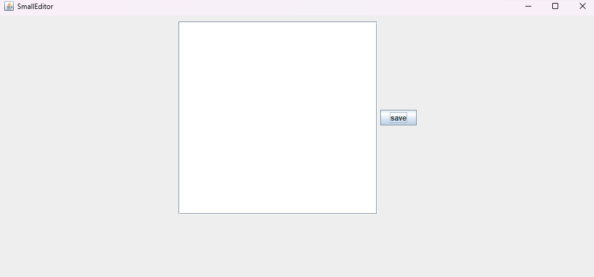

# Small Text Editor

매우 간단한 텍스트 에디터입니다. 내용 입력, 저장 기능을 제공합니다.

JAVA GUI 기본 컴포넌트 구성들과 ActionPerformed 이벤트, File 클래스를 이용하여 만들었습니다.

## 개발 과정

### 1. GUI 구성 요소 만들기

Panel, Button, TextArea를 이용하여 기초적인 GUI 환경을 만들었습니다.

```JAVA
import javax.swing.*;
import java.awt.*;
import java.awt.event.ActionEvent;
import java.awt.event.ActionListener;

public class Editor extends JFrame{
    private JPanel editorPanel;
    private JTextArea editorTextArea;
    private JScrollPane editorScroll;
    private JButton saveButton;

    public Editor() {
        setDefaultCloseOperation(JFrame.EXIT_ON_CLOSE);
        setTitle("SmallEditor");
        setSize(350, 250);
        this.setLayout(new FlowLayout());

        // textEditor
        editorPanel = new JPanel();
        editorTextArea = new JTextArea(20, 30);
        editorScroll = new JScrollPane(editorTextArea);

        // Save Button 생성
        saveButton = new JButton("save");
        saveButton.addActionListener(new SaveAction());

        editorPanel.add(editorScroll);
        editorPanel.add(saveButton);

        this.add(editorPanel);
        this.setVisible(true);
    }

    public static void main(String[] args) {
        Editor e = new Editor();
    }
}
```



### 2. 저장 기능 구현

이제 저 save 버튼에 저장 기능을 구현해줍시다.

처음에는 간단하게 `FileOutputStream` 패키지를 활용하여 구현하였습니다. 파일 불러오니 다른 좋은 기능들은 일단 제껴놓고 저장만 시켜보죠

```JAVA
public class SaveAction implements ActionListener {
        @Override
        public void actionPerformed(ActionEvent e) {
            if(e.getSource() == saveButton) {
                try {
                    String filePath = "path/to/test.txt";
                    FileOutputStream f = new FileOutputStream(filePath, false);
                    String lineToAppend = editorTextArea.getText();
                    byte[] byteArr = lineToAppend.getBytes();
                    f.write(byteArr);
                    f.close();
                } catch (Exception error) {
                    error.printStackTrace();
                }
            }
        }
    }
```

smallTextEditor 클래스 안에 추가로 구현시켰습니다. SaveAction 버튼에 ActionPerformed 이벤트를 달아주어 클릭 시 해당 경로에 저장을 해줄 수 있도록 간단한 코드를 작성하였습니다. FileOutputStream은 데이터를 추가할 시 어느 데이터든 byte로 컨버트하여 작성해야 하기에 TextArea 텍스트 데이터를 가져온 뒤 byte화 시키어 저장시켜주었습니다.