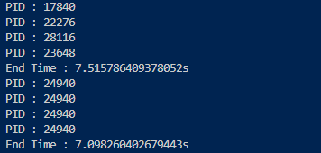
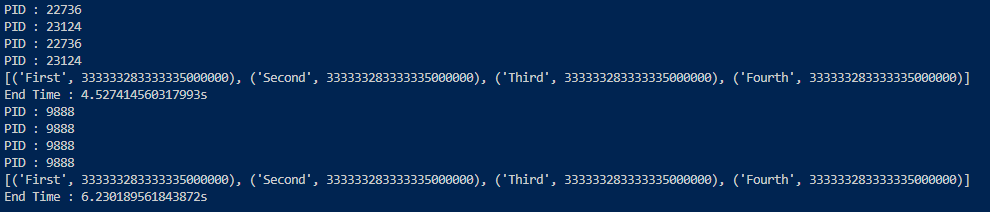
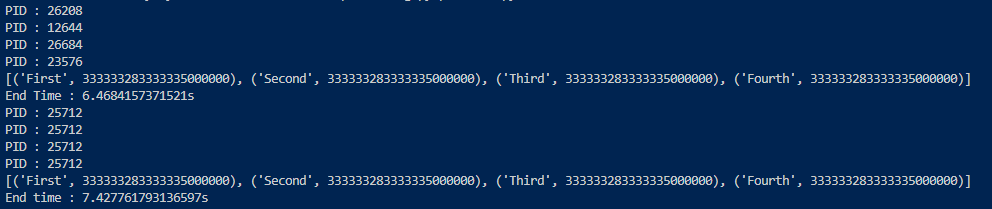
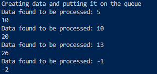
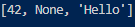
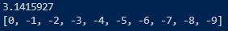
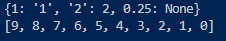

# Multi Processing

## 프로세스 기반 병렬 처리

**프로세스 기반 병렬 처리(Multi Processing)**란 **쓰레딩(Threading)** 모듈과 비슷한 API를 활용하여 **프로세스 스포닝(Process Spawning)**을 지원하는 패키지이다.

`프로세스(Process)`란 프로그램이 메모리 상에서 실행중인 작업을 의미하는데, 이 **하나 이상의 프로세스를 동시에 처리하는 것**을 멀티 프로세싱이라고 칭한다.

병렬 프로그래밍 중의 한 기법인데, 이를 활용하여 대용량 데이터 처리 및 작업 효율성 상승 등의 효과를 볼 수 있다.

멀티 프로세싱은 다수의 프로세스로 처리하므로 **안전성**이 높지만, 각각 독립된 메모리 영역을 가지고 있어 작업량이 많을수록 **오버헤드(Overhead)**가 발생할 수 있다.

조금 덧붙이면, 객체지향 프로그래밍이라는 개념도 이 멀티프로세싱이라는 개념을 통해 만들어진 듯 하다.

- `프로세스 스포닝(Process Spawning)`이란 **부모 프로세스(Parent Process)**가 운영체제에 요청해 새로운 **자식 프로세스(Child Process)**를 만들어내는 과정
- `스레드(Thread)`는 `프로세스(Process)` 안에서 실행되는 여러 흐름 단위를 의미한다.

## Process

```Python
import os
import time
from multiprocessing import Process, freeze_support

def task(idx, count):
    print(f"PID : {os.getpid()}")
    logic = sum([i ** 2 for i in range(count)])
    return idx, logic

if __name__ == "__main__" :
    freeze_support()        # 윈도우 환경에서 프로세스 개체에 대한 코드 실행 가능하도록 설정
    
    job = [("First", 10 ** 7), ("Second", 10 ** 7), ("Third", 10 ** 7), ("Forth", 10 ** 7)]
    
    start = time.time()
    
    process = []
    for idx, count in job:
        p = Process(target=task, args=(idx, count))
        p.start()
        process.append(p)
    
    for p in process:
        p.join()
        
    print(f"End Time : {time.time() - start}s")
    
    start = time.time()
    
    for idx, count in job:
        task(idx, count)
    
    print(f"End Time : {time.time() - start}s")
```


`프로세스(Process)` 클래스는 Process 객체를 생성한 후 `start()` 메서드를 호출해서 스폰한다.

이후 각 프로세스는 `join()` 메서드를 통해 자식 프로세스가 종료될 때까지 대기한다. 프로세스 종료까지 대기하는 이유는 각 프로세스마다 ID가 존재하기에 process 목록을 통해 프로세스가 종료될때까지 기다린 후 확인하기 위하여 대기를 걸어준다.

`프로세스(Process)`는 각 작업마다 새로운 프로세스가 할당되어 작업을 처리한다.



그렇다고 무조건 빨라요 빼액! 이 짓은 하지 말자...

## poll

```Python
import os
import time
from multiprocessing import Pool, freeze_support

def task(pairs):
    print(f"PID : {os.getpid()}")
    idx, count = pairs
    logic = sum([i ** 2 for i in range(count)])
    return idx, logic

if __name__ == "__main__" :
    freeze_support()
    job = [("First", 10 ** 7), ("Second", 10 ** 7), ("Third", 10 ** 7), ("Fourth", 10 ** 7)]
    
    start = time.time()
    
    p = Pool(processes = 2)
    result = p.map(task, job)
    
    print(result)
    print(f"End Time : {time.time() - start}s")
    
    start = time.time()
    
    result = [task(j) for j in job]
    
    print(result)
    print(f"End Time : {time.time() - start}s")
```



`폴(Poll)` 객체는 여러 입력 값에 걸쳐 함수의 실행을 병렬 처리하고 입력 데이터를 프로세스에 분산시켜준다.

위 명령어에서는 인스턴스를 생성하고 2개의 작업자를 생성시켜준다 : `p = Pool(processes = 2)`

`map()` 메서드를 통해 **실행하려는 함수**와 **반복 가능한 객체**를 입력하여 각 프로세스에 매핑한다.

`Poll`은 사전에 `Proceeses`의 개수를 설정하여 반복한다.
  
- 프로세스의 개수가 2개라면, **첫 번째**와 **세 번째** 작업은 같은 `PID`를 갖는다.

위에건 프로세스를 공장처럼 찍어내는 것이고, 이건 일부만 프로세스를 만들어 돌리는 것.

## parallel

```Python
import os
import time
from joblib import Parallel, delayed

def task(idx, count):
    print(f"PID : {os.getpid()}")
    logic = sum([i ** 2 for i in range(count)])
    return idx, logic

job = [("First", 10 ** 7), ("Second", 10 ** 7), ("Third", 10 ** 7), ("Fourth", 10 ** 7)]

start = time.time()

result = Parallel(n_jobs=4)(delayed(task)(idx, count) for idx, count in job)

print(result)
print(f"End Time : {time.time() - start}s")

start = time.time()

result = [task(*j) for j in job]

print(result)
print(f"End time : {time.time() - start}s")
```



`joblib` 라이브러리는 `multiprocessing` 모듈과 동일한 기능을 포함하고 있다.

다만 주요한 차이점은 매개 변수를 좀 더 쉽게 전달할 수 있으며, 대규모 `Numpy` 기반 데이터 구조에 대해 작업자 프로세스와 공유 메모리를 효율적으로 사용할 수 있다.

`Parallel(n_jobs=프로세스 개수)(delayed(함수)(인수))`의 구조로 사용할 수 있다.

`Parallel` 클래스는 병렬 매핑을 위한 클래스이다. `벡엔드(Backend)`를 설정하거나, `배치 크기(batch_size)` 등을 추가로 설정해줄 수 있다.

`delayed` 메서드는 함수의 인수를 캡처하는 데 사용되는 Decorator이다.

대규모 작업에서는 `joblib`를 활용하는 것이 효과적이다.

## Exchange object between Processes

각각의 프로세스 사이에서 서로의 값에 Communication이 필요할 때가 있다. 같은 코드 선상에 있어서 '저거 공유할 수 있지 않나? ㅋ' 라고 생각할 수도 있지만, multiprocessing으로 만들어진 프로세스는 같은 코드 선상이라도 엄연히 다른 메모리 공간을 차지하게 되어 서로의 자원을 함부로 선점할 수가 없다(같은 자원 선점시 오류 발생 가능성이 크기에 OS가 개거품 물고 달라들어 막음). 다만 개발을 하다보면 프로세스는 따로 만들어도 일부 자원은 공유해야 하는 경우가 있는데, Multiprocessing 라이브러리는 이를 대비해 `Queue`, `Pipe`을 만들어 두었다.

### Queue

Queue의 구현은 Thread와 Process를 안전하게 해준다는 게 큰 장점이고, 구조는 일반 Queue와 동일하다!

```Python
from multiprocessing import Process, Queue

sentinel = -1

def creator(data, q):
    print('Creating data and putting it on the queue')
    for item in data:
        q.put(item)
        
def my_consumer(q):
    while True:
        data = q.get()
        print('Data found to be processed: {}'.format(data))
        processed = data * 2
        print(processed)
    
        if data is sentinel:
            break

if __name__ == '__main__':
    q = Queue()
    data = [5, 10, 13, -1]
    process_one = Process(target=creator, args=(data, q))
    process_two = Process(target=my_consumer, args=(q,))
    process_one.start()
    process_two.start()
    
    q.close()
    q.join_thread()
    
    process_one.join()
    process_two.join()
```



데이터를 하나 생성함과 동시에 추출하여 출력하는 병렬 프로그램을 예시로 들 수 있다.

### Pipe

`Pipe()` 함수는 파이프로 연결된 한 쌍의 연결 객체를 돌리며 기본적으로 **양방향(Duplex)**이다. `Pipe()`가 반환하는 두 개의 연결 객체는 파이프릐 두 끝을 나타내며, 각 연결 객체에는 *send()*, *rect()* 메서드 등이 있다. 두 개 이상의 프로세스(or Thread)는 파이프의 동일한 종료 지점을 읽거나 쓰려고 하면 파이프의 데이터가 손상될 수 있다. 

```Python
from multiprocessing import Process, Pipe

def f(conn):
    conn.send([42, None, 'Hello'])
    conn.close()
    
if __name__ == '__main__':
    parent_conn, child_conn = Pipe()
    p = Process(target=f, args= (child_conn,))
    p.start()
    print(parent_conn.recv())
    p.join()
```



## Synchronization between Processes

`Multiprocessing`은 `Threading`에 있는 모든 동기화 프리미티브의 등가물을 포함한다. 예를 들어 한 번에 하나의 프로세스만 표준 출력으로 인쇄하도록 Lock을 사용해줄 수 있다.

```Python
from multiprocessing import Process, Lock

def f(l, i):
    l.acquire()
    try:
        print('Hello World!', i)
    finally:
        l.release()

if __name__ == '__main__':
    lock = Lock()
    num2 = [11, 12, 13, 14, 15, 16, 17, 18, 19, 20]
    
    for num in range(10):
        Process(target=f, args=(lock, num)).start()
        Process(target=f, args=(lock, num2[num])).start()
```

Lock을 사용하지 않으면 다른 프로세스의 출력들이 모두 섞일 수 있다.

## Share state between Processes

동시성 프로그래밍을 할 때 보통 가능한 한 공유된 상태를 사용하지 않는 것이 최선이다. 특히 여러 프로세스를 사용할 때는 더더욱 쓰지 않는 게 좋다.

허나 정말로 공유 데이터를 사용해야 할 때 해당 라이브러리는 몇가지 기능들을 제공해준다.

### Shared Memory
데이터는 `Value` or `Array`를 사용하여 공유 메모리 맵에 저장될 수 있다.

```Python
from multiprocessing import Process, Value, Array

def f(n, a):
    n.value = 3.1415927
    for i in range(len(a)):
        a[i] = -a[i]
        
if __name__ == "__main__":
    num = Value('d', 0.0)
    arr = Array('i', range(10))
    
    p = Process(target=f, args=(num, arr))
    p.start()
    p.join()
    
    print(num.value)
    print(arr[:])
```



`num`과 `arr`을 만들 때 사용되는 `d`와 `i` 인자는 array 모듈에서 사용되는 종류의 타입 코드이다. `d`는 배정밀도 부동 소수점을 나타내고, `i`는 부호있는 정수를 나타낸다. 이러한 공유 객체는 프로세스 및 스레드에 안전하다.

참고로, 공유 메모리를 더 유연하게 사용하려면 공유 메모리에 할당된 임의의 ctypes 객체 생성을 지원하는 `multiprocessing.sharedtypes`모듈을 사용할 수 있다.

### Server Process

`Manager()`가 반환한 관리자 객체는 파이썬 객체를 유지하고 다른 프로세스가 프락시를 사용하여 이 객체를 조작할 수 있게 하는 서버 프로세스를 제어.

`Manager()`가 반환한 관리자는 `list`,`dict`,`Namespace`,`Lock`,`RLock`,`Semaphore`,`BoundedSemaphore`,`Condition`,`Event`,`Barrier`,`Array`,`Queue`,`Value` 지원

```Python
from multiprocessing import Process, Manager

def f(d, l):
    d[1] = '1'
    d['2'] = 2
    d[0.25] = None
    l.reverse()
    
if __name__ == '__main__':
    with Manager() as manager:
        d = manager.dict()
        l = manager.list(range(10))
        
        p = Process(target=f, args=(d, l))
        p.start()
        p.join()
        
        print(d)
        print(l)
```



서버 프로세스 관리자는 임의의 객체 형을 지원하도록 만들 수 있으므로 공유 메모리 객체를 사용하는 것보다 융통성이 있음. 또한 단일 관리자를 네트워크를 통해 서로 다른 컴퓨터의 프로세스에서 공유할 수 있다. 그러나 공유 메모리를 사용할 때보다 느리다.

