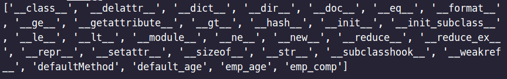

# Attribute Function

딥러닝 모델의 config를 일반적으로 object의 변수로 설정하여 받아오는 경우가 많다. 큰 규모의 딥러닝 모델의 경우 여러 config를 변경하여 모델을 설정해야 한다. 이때 해당 함수들을 사용하여 코드 내부에서 config를 변경 및 확인 작업을 해줄 수 있다.

함수 종류 : **getattr, hasattr, setattr, delattr**

## 1. getattr()

- Basic Syntax : `getattr(object, attribute_name[, default])`
- object 안에 찾고자하는 attribute의 값을 출력한다. 만약 없을 경우 default를 출력한다.

Code - Employee.py

```python
class Employee:
    emp_comp    = "Google"
    emp_age     = 49
    default_age = 56

    def defaultMethod(self):
        print("This is a default method")
```

Code - getattr.py

```python
from Employee import Employee

e = Employee()
print(getattr(e, 'emp_age'))
print(getattr(e, 'emp_age', 45))
print(getattr(e, 'emp_age_other', 45))
print(getattr(e, 'emp_age_other', e.default_age))
```

result:   


## 2. setattr()

- Basic Syntax : `setattr(object, attribute_name, value)`
- object에 새로운 attribute를 추가하고 값은 value를 준다.

Code - setattr.py

```python
from Employee import Employee

e = Employee()

print(getattr(e, 'emp_age'))
setattr(e, 'emp_age', 100)
print(getattr(e, 'emp_age', 45))

setattr(e, 'emp_sex', 'man')
print(getattr(e, 'emp_sex', 'woman'))
```

result:   


## 3. hasattr()

- Basic Syntax : `hasattr(object, attribute_name)`
- object에 attribute_name이 있는지 확인한다. 그러고 True or False를 출력한다.

```python
from Employee import Employee

e = Employee()
e1 = Employee()

print(hasattr(e, 'emp_address'))
setattr(e, 'emp_address', 'Korea')
print(hasattr(e, 'emp_address'))
print(hasattr(e1, 'emp_address'))
```

result:   


## 4. delattr()

- Basic Syntax : `delattr(object, attribute_name)`
- object 내부의 attribute_name와 같은 attribute를 삭제한다.

Code - delattr.py

```python
from Employee import Employee

e = Employee()
e1 = Employee()

print(hasattr(e, 'emp_comp'))     
print(hasattr(e1, 'emp_comp'))      
delattr(Employee, 'emp_comp')    
print(hasattr(e, 'emp_comp'))     
print(hasattr(e1, 'emp_comp'))     

print(hasattr(e, 'emp_age'))     
print(hasattr(e1, 'emp_age'))     
del Employee.emp_age                # Same = delattr(Employee, 'emp_age')
print(hasattr(e, 'emp_age'))      
print(hasattr(e1, 'emp_age'))     
```

result:   


## + dir

`dir()` 명령어를 통해 해당 object의 전체 attribute를 확인할 수 있다.

```python
from Employee import Employee

e = Employee()

print(dir(e))
```

result:   

