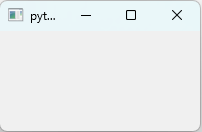
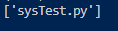

# 윈도우 만들기

## 윈도우 만들기

PyQt에서 모든 위젯의 가장 기초가 되는 위젯을 윈도우라고 부른다. 이 창(윈도우) 위에 `버튼`과 같은 위젯들이 배치된다. 나만의 윈도우 클래스를 만들어서 사용하려면 PyQt가 제공하는 `QMainWindow`를 사용 받아 클래스에 정의 시켜야 한다.

```Python
import sys
from PyQt5.QtWidgets import *

class MyWindow(QMainWindow):
    def __init__(self):
        super().__init__()

app = QApplication(sys.argv)
window = MyWindow()
window.show()
app.exec_()
```



이러면 다음과 같은 윈도우가 출력되게 된다.

## sys 모듈의 정체

sys 모듈을 사용하기 위해 임포트 한 후 `sys.argv`라는 표현을 사용했다. 여기서 sys는 모듈 이름인데, 즉 sys.py 파일이 파이썬 설치 경로의 라이브러리 디렉터리에 존재한다. 이 argv는 변수 중 하나다.

얘는 뭐하는 앨까? 궁금한건 못참징

```Python
import sys

print(sys.argv)
```



... 그냥 파일 이름을 나타내준다. 노잼

이 구조를 역이용해서 Window를 만들 때 굳이 sys를 호출하지 않고 파일 이름을 인자값으로 넘겨도 된다!

```Python
from PyQt5.QtWidgets import *

class MyWindow(QMainWindow):
    def __init__(self):
        super().__init__()


app = QApplication(["create_window.py"])
window = MyWindow()
window.show()
app.exec_()
```

## super()의 의미
파이썬에서 super()는 부모클래스를 의미한다. `MyWindow` 클래스는 `QMainWindow` 클래스를 상속 받는데 생성자에서 부모클래스인 `QMainWindow`의 생성자를 호출해줘야 한다. 다만 이는 `QMainWindow` 클래스만이 요구하는 사항이지, 모든 클래스를 상속 받을 때 반드시 부모 클래스의 생성자를 명시적으로 호출할 필요는 없다. 