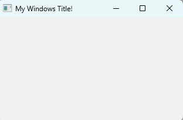
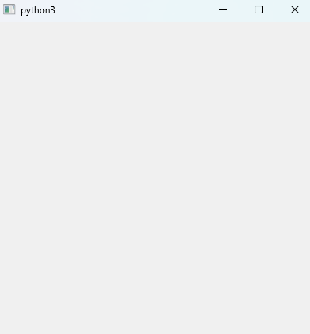

# 윈도우 꾸미기

## 윈도우 타이틀 변경

윈도우가 생성되면 생성자(`__init__`)가 호출된다. 따라서 **생성자 안에 윈도우 객체에 접근한 후 타이틀을 변경하는 메소드를 호출**해주면 윈도우의 타이틀 변경 가능

```Python
import sys
from PyQt5.QtWidgets import *

class MyWindow(QMainWindow):
    def __init__(self):
        super().__init__()
        
        self.setWindowTitle("My Windows Title!")
        
app = QApplication(sys.argv)
window = MyWindow()
window.show()
app.exec_()
```



## 윈도우 크기 변경

`QMainWindow` 클래스에는 윈도우의 출력 위치 및 크기를 변경하는 메서드인 `setGeometry()`가 정의되어 있다. MyWindow는 `QMainWindow` 클래스를 상속 받았으므로 `self`라는 변수를 통해 이를 호출할 수 있다. `self.setGetMetry()`라고 호출하면 `self`가 가리키는 객체에는 `setGeometry()`가 없으므로 MyWindow로 간다. 하지만 MyWindow가 가리키는 객체 공간에도 `setGeometry()`가 없으므로 부모 클래스인 `QMainWindow`로 이동한다. 여기에는 `setGeometry()` 메서드가 있으므로 이를 호출한다.

위에 어렵게 설명해놨는데, 그냥 `QMainWindow`에 있는 `setGeometry()` 함수로 알아서 찾아간다는 거다.

```Python
import sys
from PyQt5.QtWidgets import *

class MyWindow(QMainWindow):
    def __init__(self):
        super().__init__()
        self.setGeometry(300, 300, 400, 400)
        
app = QApplication(sys.argv)
window = MyWindow()
window.show()
app.exec_()
```



## 아이콘 넣기

png 아이콘 파일을 다운로드한 뒤, 파이썬 코드와 동일 디렉터리로 이동한다.(다른 디렉터리도 괜찮긴 하지만 경로 찾기 까다로움) 윈도우에서 아이콘 설정은 `setWindowIcon()` 메서드를 사용한다. 근데 이 메서드는 `QIcon` 클래스의 인스턴스를 인자로 받는데, 이 인스턴스를 생성할 대는 초기화자로 아이콘 파일의 경로를 문자열로 넘겨주면 된다. 그리고 QIcon 클래스는 QtGui 파일에 정의되어 있기에, `from PyQt5.QtGui import *` 를 추가해줘야 한다.

```Python
import sys
from PyQt5.QtWidgets import *
from PyQt5.QtGui import *

class MyWindow(QMainWindow):
    def __init__(self):
        super().__init__()
        self.setGeometry(300, 300, 400, 400)
        self.setWindowIcon(QIcon("bluetooth.png"))  # https://www.flaticon.com/
        
app = QApplication(sys.argv)
window = MyWindow()
window.show()
app.exec_()
```


