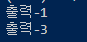

# Event Loop

## 알아보기
PyQt의 이벤트 루프는 무한이 반복하면서 이벤트가 있으면 처리하는 구조로 되어있다. 이벤트 루프는 윈도우가 종료될 때 끝나게 된다.

```Python
while True:
    이벤트가 있으면 처리
    if 윈도우 종료 버튼 클릭:
        break
```

PyQt는 QApplication 클래스의 객체에서 `exec_()` 메서드를 호출하면 이벤트 루프가 생성되고 실행된다. 이를 보다 명확히 알아보려면 `print()` 함수를 추가해주면 된다.

```Python
import sys
from PyQt5.QtWidgets import *

class MyWindow(QMainWindow):
    def __init__(self):
        super().__init__()
        
print("출력-1")
app = QApplication(sys.argv)

window = MyWindow()
window.show()

app.exec_()
print("출력-3")
```



코드를 실행하면 '출력-1'이라는 글자가 출력되고 화면에 윈도우가 출력된다. 하지만 '출력-3'이라는 글자는 출력되지 않는 것을 알 수 있다. 파이썬 코드는 기본적으로 위에서 아래로 수행되는데 `app.exec_()` 코드에서 반복문을 수행하고 있기 때문에 해당 반복문이 끝날 때까지는 '출력-3'이라는 글자가 화면에 출력되지 않는 것이다. 만약 윈도우를 닫게 될 시 이제 `exec_()`를 통해 생성된 무한 루프가 끝나게 되고 그 다음 줄의 코드가 실행되면서 '출력-3'이라는 글자가 출력되는 것을 알 수 있다.