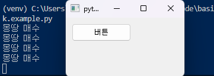

# 위젯 이벤트 처리

## 이벤트 처리하기
버튼 위젯은 사용자에 의해 클릭될 수 있다. 반대로 사용자는 버튼을 보면 보통 클릭한다. 앞서 매수를 할 수 있는 버튼을 만들어봤는데 사용자는 매수를 하고 싶을 때 매수 버튼을 누른다. 이때 프로그램 입장에서는 사용자가 매수 버튼을 누르면 매수 동작을 수행해야 한다. PyQt에서는 사용자가 버튼을 클릭하는 행위를 **'시그널'**이라고 하고 버튼을 클릭했을 때 수행할 함수를 **'슬롯'**이라고 한다.

간단히 매수 버튼이 클릭했을 때 수행되어야 하는 함수를 MyWindow 상단에 추가한다.

```Python
# 코드 생략

def buy():
    print("몽땅 매수")

class MyWindow(QMainWindow):
    # 이하 코드 생략

```

이제 버튼이 클릭되면 위에서 구현한 buy 함수를 호출해달라고 PyQt의 이벤트 루프에 한 번 등록만 해주면 된다. 이처럼 어떤 위젯에서 이벤트가 발생했을 때 이를 처리하는 함수 또는 메서드를 등록하면 해당 이벤트가 발생할 때 PyQt의 이벤트 루프가 알아서 이벤트에 연결된 메서드를 자동으로 호출해준다. 보통 함수는 프로그래머가 명시적으로 `함수이름()`과 같은 표현을 통해 호출하는데 이처럼 이벤트 루프에 의해 호출당하는 함수를 **콜백(callback) 함수**라고 부른다.

```Python
import sys
from PyQt5.QtWidgets import *

def buy():
    print("몽땅 매수")
    
class MyWindow(QMainWindow):
    def __init__(self):
        super().__init__()
        btn = QPushButton("버튼", self)
        btn.move(10, 10)
        btn.clicked.connect(buy)  # 이벤트 함수 연결

app = QApplication(sys.argv)
window = MyWindow()
window.show()
app.exec_()
```



코드가 실행된 후 버튼을 클릭하면 콘솔창에 '몽땅 매수'라는 글자가 출력됨

## 메서드로 구현하기
이번에는 MyWindow 클래스 안으로 집어 넣어보자. 꼭 이렇게 해야하는 건 아니지만 보통 이런 구조로 프로그램을 짜는게 일반적이다.

위에서 만든 `buy()` MyWindow 클래스에 메서드로 정의했다. 따라서 첫 번째 인자는 `self`로 변경되어야 한다. 따라서 클래스 내에서 buy 함수를 이벤트 루프로 호출하려면 `self.buy` 형태로 되어야 한다.

```Python
import sys
from PyQt5.QtWidgets import *

class MyWindow(QMainWindow):
    def __init__(self):
        super().__init__()
        btn = QPushButton("버튼", self)
        btn.move(10, 10)
        btn.clicked.connect(self.buy)
        
    def buy(self):
        print("몽땅 매수")
        
app = QApplication(sys.argv)
window = MyWindow()
window.show()
app.exec_()
```

결과는 똑같다.

## 창 닫기

