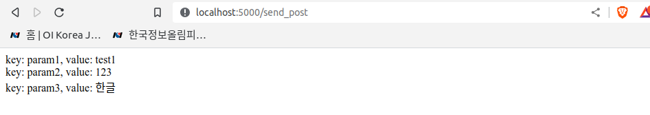

# Post 요청 처리

## post 요청 보내기

특정 page에 접속할 시, post 요청을 처리하는 page에 post 요청을 하는 코드들이다. 

### `send_post` 요청 처리

해당 페이지 접속 시 `requests` 모듈을 이용하여 `handle_post` page에 post 요청을 진행한다. 또한 `handle_post` page에 전달받은 결과를 리턴한다.

```py
import requests

@app.route('/send_post', methods=['GET'])
def send_post():
    params = {
        "param1": "test1",
        "param2": 123,
        "param3": "한글"
    }
    res = requests.post("http://127.0.0.1:5000/handle_post", data=json.dumps(params))
    return res.text
```

### `handle_post` 요청 처리

post 요청을 처리하는 handle_post 생성한다. post 요청을 위해 `app.route` 인자에 `methods=['POST']`를 넣어야 하며, 전달받은 data를 `json.loads`를 이용해 dicitionary 형태로 변환하여 파싱한다.

```py
@app.route('/handle_post', methods=['POST'])
def handle_post():
    params = json.loads(requests.get_data(), encoding='utf-8')
    if len(params) == 0:
        return 'No parameter'
    
    params_str = ''
    for key in params.keys():
        params_str += 'key: {}, value: {}<br>'.format(key, params[key])
    return params_str
```

## result



## 출처

https://apt-info.github.io/%EA%B0%9C%EB%B0%9C/python-flask3-post/